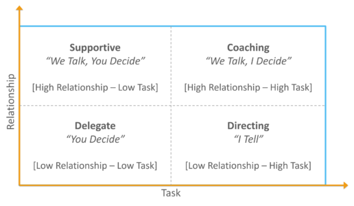
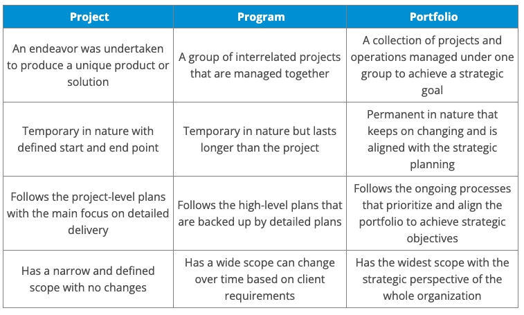
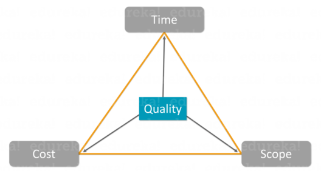

# Common Questions:
## 1. Tell me about yourself.
    1.1 Current project and contributions.
    1.2 Previous Projects and Contributions.

It is a common question that the interview usually starts with. The interviewer aims to summarize your journey and your primary skills to determine the follow-up questions and establish how well you might fit into the role. 

An excellent answer to this question would be to mention your present status, then go into the past with the companies you have worked for, at what positions, your strengths and the number of successful projects you have worked on. Do mention your years of experience; if you are a fresher, elaborate on your education. Finish the answer by mentioning your professional goals or what you hope to achieve at this job.

## 2. Can you briefly tell us about the last project you worked on?
The interviewer is looking for some aspects in your answer to place your seniority, determine the type of projects you have experience working on, your working style, the size of the team you handled and so on.

Start by mentioning the crucial points of the project. Ensure to include the team size, goal, deliverables and the approach used to complete it. Elaborate on the result by using some key statistics and metrics attained by the end of it. It is good to answer honestly and mention things that went well and anything you learned.

## 3. Tell us about an incident where something went wrong in your project while you were managing it.
Challenges often arise in projects. The interviewer's main aim here is to know the nature of the problem and how you dealt with it. They want to understand if you can work under pressure and your strategy to deal with unforeseen setbacks.

Describe the project, the problem, and why it went wrong. Follow this up with the solution that you were expected to execute. This is where you will elaborate on how you tackled the problem and mention how it solved it, the project's outcomes, and what you learned from it. 

## 4. Tell us about your most successful project.
The recruiter wants to understand your definition of success through this question. While meeting the budget, deadlines, goals and deliverables are essential elements of success, it could also be incorporating change, tackling problems, adapting to change, and so on.

You can use this chance to elaborate on your strengths. While telling your success story, elaborate on your role and contributions, and acknowledge your team's efforts. Mention any critical factors that led to the success of the project.

## 5. Do you have any experience with budget management?
A specific question like this is aimed at understanding your skills. If you do not have any experience, it is best to be honest about it and share any budgeting experience you have from your personal life. Also, mention how good you are at picking up new skills.

If you do have professional budget management experience, it will be an added advantage to your candidature. Elaborate with specific project examples and outcomes. 

## 6. What is a project plan?
The interviewer wants to know your technical understanding of the different aspects of a project. Elaborate on the elements of a project plan that you know, such as milestones, team members and tasks. Then follow it up with how you have worked with it in the past, brief about its key features and how its implementation in your project led to a successful outcome.

## 7. How do you facilitate an environment of collaboration on your team?
Collaboration, teamwork and motivation are essential to achieve positive goals and fostering a supportive, positive work environment is essential. It is best to elaborate on this answer with an example from your past experience on how you facilitate good communication. Moreover, mention any strategies or techniques you use, such as team-building exercises, creating communication structures or starting meetings with icebreakers.

## 8. How do you define an ideal project? 
This question, being one of the most important project management interview questions, intends to know the type of projects you would like to take up. By answering this question honestly, you open up an opportunity to manage projects that excite you or those in which you can excel. Your answer should include multiple points such as whether you like to work as part of a team or alone, the kind of deadlines you prefer, whether you are interested in innovative and creative projects or not, and more. 

## 9. Work from home has become the new normal in the post-COVID-19-world. How well are you prepared to manage a remote team?  
In the present world, project managers often choose their teams from a global workforce and are expected to manage teams remotely. You should be equipped with the knowledge and skills to work with team members virtually. It calls for a different management technique. Your answer to this project management interview question should clearly describe the project management methodology you may choose to manage people and resources in a remote environment. 

## 10. How do you determine the prioritization of tasks in any project?
A vital element of project management is the ability to prioritize tasks optimally. The interviewer seeks to know how you would prioritize tasks and why. They might also follow up with a question about your ability to work on multiple projects simultaneously.

Frame the answer in a way that ties to the objectives and interests of the project. Explain the prioritization process using a combination of the project's goals, constraints, and stakeholders' needs. You could also mention setting deadlines, identifying critical path tasks, or balancing resources across multiple projects. To illustrate your approach, use examples from prior experiences or hypothetical scenarios.

## 11. What is the most desired skill that is required to become a successful project manager, according to your experience? Please give us a couple of examples regarding your past projects. 
If you are experienced in project management, you might probably know that there is no single skill that is enough for a successful career in the field. To be a successful project manager, you should possess multiple project management skills like leadership skills, communication skills, negotiation skills, and time management skills, to name a few. To answer this question promptly, you should be able to justify why you have chosen a particular skill. You can include a couple of examples to substantiate your answer. 

## 12. Tell us about the most challenging projects you have managed so far? What were the steps you have taken to tackle the challenges?
Here, the interview panel wants to know how you respond to critical challenges and deal with conflicting situations in a project. It would be best if you did not refer to examples where you had to manage tough team members or lack of support from management. As a project manager, you should be smart enough to handle such occurrences. Instead, focus on external factors like a situation where the project was unexpectedly called off, or funding was reduced in the middle of an extensive project. Also, you should explain how you tackled the challenges and managed the team during tough situations. 

## 13. Suppose the project has gone off the rails. What steps would you take to get it back on track?
Once you realize a project is not going as per the pre-planned time, budget, scope, or goals, the next top priority is to get it back on track. The project manager should be efficient enough to take the necessary steps to resolve the discrepancy between actual progress and planned progress. Your answer to this project management interview question may include re-adjusting resource management, finding the real cause of off-tracking, putting in extra effort, and more. 

## 14. Which was one of the biggest mistakes you have committed in your past projects? How has it impacted your approach to work? 
To err is human, they say. It is how you deal with the errors that define your skills. By asking this project management interview question, the interviewer intends to check your honesty and whether you take responsibility of mistakes you have made in your past projects. Rather than giving a ‘no’ for the answer, you can mention a couple of mistakes. Make sure you show that you take responsibility for the mistake as it is a way to reveal your maturity level. Also, you can explain how you had resolved it.

## 15. Can you tell us an example of a failed project? Have you had any such experiences? 
Success and failure are part of your career as a project manager. It is not wise to answer ‘no’ to this question as well. Instead, you can think of an event or phase in your previous projects where you have experienced failure. This project management interview question aims to check your experience in managing risk too. You need to include how you have handled the issue. 

## 16. Suppose the customer is not happy about the quality of the project outcomes. How do you handle the situation? What is your way of handling an unhappy stakeholder?
As a project manager, you will be answerable when the customers are unhappy about the project outcomes. While you answer this project management interview question, you should be able to reveal how much you value the customers and that you would accept their authority without being critical. You can say that you will try to make the necessary modifications that the customer is looking for. You can explain the steps you have taken to ensure regular interaction with the customer throughout the project. Also, you can say that you will communicate effectively to make the customer understand that the outcomes are within the scope of the project. 

## 17. What is your strategy to deal with internal conflicts among the team members? 
Here, the interviewer is trying to understand your mediation skills and how impartial you are while resolving conflicts. You can explain why there is a necessity to listen to both the parties and understand both perspectives. Your answer should include how you convince both the parties to come to a conclusion that works best for the project at hand and delivers a win-win situation. Also, it would help if you communicate how you ensure that both of them are not benefitting at the loss of the other.

## 18. Define processes and process groups in a project management framework. 
This project management interview question aims to understand your domain knowledge. In a project management framework, processes refer to the defined way of doing tasks for completing the project successfully. On the other hand, process groups are a collection of processes that are carried out at various stages during the project. Initiation, Planning, Executing, Monitoring & Control, and Closing are the five process groups.

## 19. Can you explain the differences between risk and issues? What are the major types of risks that may be encountered in a project?
Risks refer to an uncertain event or situation in the future that would bring a negative or positive impact on the project goals. Issues apply to any event or situation that currently impacts the project objectives. In other words, risk focuses on future events while issues are more of present occurrences. Issues are often considered negative, say a team member suddenly resigns from the organization. Risks would be either positive or negative.

### The following are the most common forms of project risks:
Market Risk, Schedule Risk, Cost Risk, Resource Risk, Performance Risk, Technology Risk, Governance Risk, Legal Risk, External Risk, Strategic Risk, Operational Risk are all factors to consider.

## 20. What are the techniques you may use to define the scope of a project? 
With this question, the interview panel is trying to understand your knowledge in the concerned domain. You can explain these various concepts involved in defining the scope of the project that include – Product Breakdown, Requirement Analysis, Systems Engineering, Systems Analysis, Value Engineering, Value Analysis, and Alternatives Analysis. 

## 21. When would you escalate an issue?
- The problem might cause a project delay or budget overrun.
- You've attempted to reach an agreement and establish a common ground with everyone concerned.
- You've previously tried and failed to solve the problem with various methods.
- You or other teammates are forced to take on a large quantity of extra work due to the problem.

## 22. What were the communication challenges on your last project?
As a project manager, you’ll need to communicate with your team for all projects effectively. Communication challenges will arise; nobody expects that this won’t happen. What the interviewer wants to see, however, is how you’ve handled these challenges in the past. It needs to be evident that even with communication issues, you were still able to work with your team effectively. For example, perhaps instead of being able to have face-to-face meetings when necessary, you were able to put together webchat meetings. Think of a time when something like this happened and how you dealt with the communication challenges efficiently to ensure that the project outcome was still a good one.

## 23. What is your communication style with your team?
If your interviewer asks this, you’ll want to assure him or her that you are an effective communicator who motivates others on your team. Not only should good project managers be encouraging when delegating to their team, but they should also be clear in their expectations. Make sure you point out that you understand the significance of being an effective communicator as a project manager.
While the first question helps the interviewer assess how effectively you can handle communication in challenging situations, the second question helps understand how you engage with others, whether you demonstrate good sense and judgment, and are able to use language effectively.

## 24. How do you communicate bad news?
It’s likely you’ve had to deliver bad news in the past as a project manager, and your interviewer wants to see how, exactly, you go about doing so. They want to see that you’re considerate and upfront with everyone, that you have all of the facts first, and that you’ve thought about how this news will impact all of your team members—not just the person you’re delivering the bad news to directly.

## 25. How have you handled disgruntled employees?
The interviewer wants to see that you’re a critical thinker and an effective problem solver. Even if you don’t have a specific example to talk about, explain that you always care about your team members and would want to uncover the root of the problem, and find out why, exactly, they’re unhappy. While it may not be possible to please every disgruntled employee, the interviewer just wants to see that you would make an effort to rectify the situation and be professional about everything.

## 26. What are some examples of times you’ve kept your promise even when that might have been difficult?
Think about a time when you reluctantly agreed to a challenging request, because as a project manager, you’re expected to make things happen. Explain to the interviewer how you managed to juggle your tasks and effectively manage your time to ensure that you would be able to follow through with an ambiguous promise. Even though you may have had a lot on your plate, interviewers want to hear specific examples that show you were still successful in accommodating additional requests.

## 27. How do you ensure you and your team deliver or exceed customer expectations?
In a nutshell, the interviewer wants to see how, in detail, you’re able to succeed as a project manager. After all, meeting (or exceeding) customer expectations when it comes to project delivery is your ultimate goal. It’s important not to be vague and give a generalized answer; you’ll want to give precise examples and details about your process.

## 28. What are some best practices you’ve used to develop excellent customer relationships?
Current clients make the best repeat customers, and it’s important to maintain excellent relationships, beyond just delivering them what they paid for. The person interviewing you wants to know you feel this way also, so as you explain the ways you’ve maintained excellent customer relationships, be sure to stress the importance of always having a very happy customer.

## 29. How do you go about managing the performance of your team?
It’s important to show that you have leadership skills when you answer this question. Be thorough about your daily tasks when it comes to managing your team’s performance—for example, perhaps you hold weekly strategy discussions and meetings. You’ll also want to provide specific examples of how your management style has resulted in positive team performance.

## 30. How do you motivate team members?
It’s crucial as a leader to not only ensure your team stays on the right track but also gets motivated about the projects they’re working on. Maybe you give praise for a job well done as a form of motivation. As long as you can demonstrate past examples of how you’ve motivated team members, there’s not a right or wrong answer here.

## 31. What are some of the tools and resources you’ve used to develop your team?
This is your chance to show your knowledge of some of the many different technologies that project managers use these days. Be sure to name any software programs, online tools, and other things that you’ve used to complete your daily tasks. Be sure also to explain that you are always open and eager to learn new tools or programs.

## 32. What is your delegation style?
This is a question that is designed to ask about leadership skills. Explain what has been best for you and use examples of how your delegation style has worked well in the past. Even if you’ve never technically led a team before, it’s important to find an example of how you might’ve delegated in the past.

## 33. How easily do you delegate responsibility?
Easily delegating responsibility is an essential quality of any project manager. Be sure to discuss a relevant example that assures the interviewer that delegating responsibility comes naturally to you.

## 34. How do you monitor and review the delegated responsibilities?
As a project manager, it’s important to routinely stay on top of your team members’ tasks and responsibilities. Discuss how you do this with specific examples—whether it’s by scheduling brief meetings, using project management software, and so on.

## 35. What are your career and project goals for the next six months?
Be honest about any short-term project goals you have currently, as this shows the interviewer that you are enthusiastic about your projects and that you’re goal-oriented. When it comes to discussing your career goals, be sure to include the company you’re interviewing with as part of your goals. If you’re interviewing with a recruiter for job placement, you may not have a specific company in mind, and that’s okay—just be sure to be clear about what type of role you see yourself working in.

## 36. How do you set goals for your team? And how do you track these goals?
Whether it’s deadline goals or overall project goals, setting goals is an important part of being a project manager, as it motivates team members and helps to keep projects on track. Be sure to give specific examples that demonstrate how you’ve set goals for your team in the past and how you’ve tracked these goals. For instance, you might have set a project completion goal for a specific project that required everyone to complete their part by a certain date. Perhaps you regularly checked in with team members to see if any obstacles could stop them from meeting that deadline and if so, you offered possible solutions.

## 37. Describe two areas in your current project, where there is a high level of uncertainty. How do you tackle these uncertainties?
No project goes without a hitch, and people expect that. What your interviewer wants to see is how you handle anything that can result in a potential setback. An effective project manager should always have a few tricks up his or her sleeve.

## 38. How do you control changes to your project?
Some level of change is inevitable, but as a project manager, it’s important to adapt to those changes quickly. Explain to your interviewer how you continue to keep your team on track whenever any project changes pop up.

## 39. How do you ensure that your project is always on track?
Your interviewer wants to understand your work process and see that you’re detail-oriented. Explain how you check in with your team throughout a project. For example, you may want to point out that you believe effective and regular communication is key to ensuring that a project stays on track.

## 40. What tools do you use as a manager to plan your activities as well as that of your team?
From meetings to project management programs and everything in between, there’s an endless list of tools and processes that project managers use to stay organized. Be sure to list as many tools as you can think of that you’re familiar with to demonstrate your knowledge of project management software and other tools.

## 41. Give a few examples of proactive decision-making in your past projects and your life in general.
It’s always important to take the initiative as a project manager, and your interviewer wants to see just how you do that. Think of specific project examples that included a lot of proactive decision-making, but don’t also be afraid to include examples that don’t include the workplace.

## 42. Can you give me a few examples of a time when you made a tough decision, and it backfired?
This question is a tough one for candidates to handle as it tells the interviewer how honest you are with yourself and compels you to talk about an instance when you failed. Your interviewer wants to see how you handle setbacks because no matter how good you are at your job, they will happen. Most importantly, they want to know what you learned from these experiences. When you give your examples, explain how you used those setbacks to improve as a project manager overall.

## 43. How do you identify stakeholders?
- Furnishing funds(Investors/Sponsors)
- Supplying resources(External Vendors)
- Being the end customers(End Users)
- Supporting you(Internal Team Members)
- Giving guidelines/regulations(Government/Excutives)

## 44. Why do you need to know more about stakeholders?
Knowing about stakeholders will help you engage them. The project's success means fulfilling the stakeholders' objectives and expectations. So engaging will result in project success. 

## 45. What details should a project plan include?
```js
Project Title: [Project Title]

Project Start Date: [Start Date]
Project End Date: [End Date]

Project Manager: [Project Manager]
Project Sponsor: [Project Sponsor]

Project Objectives:
[Objective 1]
[Objective 2]
[Objective 3]

Project Scope:
[In-scope item 1]
[In-scope item 2]
[Out-of-scope item 1]
[Out-of-scope item 2]

Project Deliverables:
[Deliverable 1]
[Deliverable 2]
[Deliverable 3]

Project Milestones:
[Milestone 1]
[Milestone 2]
[Milestone 3]

Project Timeline:
Phase 1: Planning
[Task 1]
[Task 2]
[Task 3]
[Start Date - End Date]
Phase 2: Execution
[Task 1]
[Task 2]
[Task 3]
[Start Date - End Date]
Phase 3: Monitoring and Control
[Task 1]
[Task 2]
[Task 3]
[Start Date - End Date]
Phase 4: Closing
[Task 1]
[Task 2]
[Task 3]
[Start Date - End Date]

Resources:
[List of project team members and their roles]
[List of external vendors or partners]

Budget:
[Total project budget]
[Breakdown of budget by category]

Risks and Issues:
[List of identified risks]
[List of open issues]

Communication Plan:
[Stakeholders and their communication needs]
[Frequency of project updates]

Quality Assurance:
[Quality standards and criteria]

Approval and Sign-off:
[List of approvers]

[Date of project plan approval]

Appendices:
[Additional documents, charts, or reference materials]
```

## 46. What are the steps for efficient risk planning?
- Discovering risks
- Analyzing potential risks
- Prioritizing risks
- Developing risk response
- Maintaining risk register

## 47. What creative problem solving techniques do you use?
It’s worth probing the technical skills of candidates. Can they talk knowledgably about fishbone diagrams, De Bono’s thinking hats, role play? Branch out to talk about the last project issue they resolved with creative thinking.

## 48. What Methods Will You Use to Deliver the Results We’re Looking For?
When answering this question, it’s good to highlight techniques that you’ve used successfully in the past and identify the tools and support you expect your employer to provide. However, it’s also important to show that you understand the challenges inherent to that particular company and project. The interviewer may be looking to see if you’ll take a one-size-fits-all approach to your project manager duties, or if you’ve given some thought to the demands of a particular job.

Because of this, a generic answer is likely to fall short. Most interviewers don’t want to hear that a prospective project manager will apply the same framework to every problem; they want to know that the person they hire will take the unique nature of each project into account. To give a well-considered answer, it’s a good idea to respond to some questions of your own. For example, find out who your project sponsor will be, what support you’ll receive from the various departments involved in the project and what recourse you’ll have if shifting priorities impact resource allocation.

This means that you’ll have to do some quick thinking on your feet to process the interviewer’s answers and address how they will impact your approach to the project. The key is to demonstrate that you’ll ask the right questions at the outset rather than make broad statements that suggest you would take the same approach to any project manager job.

## 49. How Will You Put Together Your Project Team?
In asking a question like this, interviewers are really trying to find out what kind of a leader you are. They want to know if you understand the diverse skills and competencies that are required to bring a project to completion. Will you seek out people just like yourself, or are you prepared to work with many different personalities? Can you inspire and motivate everyone from senior executives to hourly support staff? Your answer should show that you recognize it takes many individual contributors with different strengths and capabilities to complete a project. A successful project manager doesn’t have to be good at everything; he or she just needs to know how to assemble and manage a team with expertise in a wide variety of areas.


## 2. Why do you leave your current job?
    2.1 No Negative Answer
    2.2 Honest and Clear
## 3. Why do you want to work for this company? (Why do you want to be a Project Manager?)
    3.1 This company attracts Points
    3.2 Clear Answer
    3.3 Skills fit this position (a bit of a challenge due to this great company)
## 4. What role does Project Manager perform? (What is the role of a Project Manager?)
    4.1 Roles Perform
    4.2 My Impression
        4.2.1 Project Management
        4.2.2 Timeline, Resource, and Other Process Elements
        4.2.3 Risk Management
        4.2.4 Budget Management (optional)
## 5. What qualities are for Performing effectively?
    5.1 Communication skills
    5.2 Be Honestly
## 6. What does a typical day look like as a Project Manager?
    6.1 Key Duties
        6.1.1 Planning
        6.1.2 Communicating New Requirements
        6.1.3 Changing Management
        6.1.4 Committing to the Project Procedures
## 7. How do your peers describe you? (Describe your greatest strengths as a release manager.)
    7.1 Honestly (nitty-gritty and flexible)
    7.2 Relevant to this position
## 8. What viewpoint do you hold regarding management?
    8.1 Relevant to this Position
    8.2 Clear
## 9. As a manager, how do you manage your success? (How would you gauge your success in this position?)(What's your success matrix for this role)
    9.1 The way to measure success.
    9.2 Relevant to this position
## 10. How do you deal with a subordinate’s inefficiency?
    10.1 The way you take concern about the underperformed employee.
    10.2 The way you deal with it
        10.2.1 Plan -> Tool -> Method
## 11. In What way can inspire your peers?
    11.1 State 2~3 ways to inspire them
    11.2 Your impression
## 12. How do you see the duty delegation?
    12.1 How to delegate work?
    12.2 Prove it does or doesn’t work perfectly using stories.
## 13. Where do you see yourself in five years?
    13.1 Where and Why
    13.2 How
    13.3 Relevant to this position
    13.4 I guess the point is to see if you are a self-improvement for this position and if you are going to stay for a long-term with this company.
## 14. What’s your most difficult situation and how to overcome it?
    14.1 What difficult situation  (Advocate the PMP framework into the real world)
    14.2 How to solve it
## 15. How do you respond to the work pressure? (Provide an example of a time when you had to manage a project with a tight deadline. What strategies did you use to stay on track?)
    15.1 What pressure
    15.2 How do you overcome it
## 16. What have you done to improve your knowledge in the last 12 months? (What are you reading now) (What do you do to update yourself on the latest software and technology?)
    16.1 List the undertaken activities related to career development (PMP/Writing)
    16.2 What impact to your career path
## 17. How does your project team cooperate with the development team or other teams?
    17.1 Communicating effectively
    17.2 Delegating tasks related
    17.3 Motivating developers
    17.4 Setting Clear expectation and Deadline
    17.5 Regular check-in
## 18. What are the differences between Project Manager and Product Manager?
## 19. What are the release and change management processes? (Release Management in PMI)
## 20. How to make sure the CI/CD is supportive? 
    20.1 What’s my CI/CD pipeline framework
    20.2 Tailer it to suit the specific situation
## 21. As a Project Manager, what motivates you every day? (What keep you going every day)
    21.1 This company’s mission
    21.2 Personal Mission(leave somthing valuable to the world)
## 22. What will you do in the first month once you were a project manager?
- Listen, observe and learn
- Understand your client’s needs and wants
- Know your team and their personalities
- Take the opportunity to learn some new skills
- Help out around the workplace
- Try to master the tools your company possesses
## 23. What kind of necessary skills should a project manager have? (What qualities might a project manager possess to do their job well?)
    23.1 For Standard Project Manager
        Industry Context Technical Knowledge
        Project Management Skills
    23.2 For Enterprise Project Manager (Program/Portfolio Manager)
        Business Awareness
## 24. How do you drive your project through data? (HR/Cost/Progress/)
## 25. What makes you stand out from the other candidates applying for this role?
## 26. What is your process for making decisions related to your work?
## 27. How will prioritize tasks in your project?
1. List the tasks and responsibilities
2. Distinguish between urgent and important

<br>
<br>
<br>

# Experience-Related Questions
## 1. Tell me about your collaboration process with your software development team.
## 2. How do you approach a situation where your team's work has not met your standards?
## 3. Talk to me about a time when your product release did not happen on the target date.
## 4. What do you think your last team would say about your leadership style?
    4.1 Common Leadership Styles;
        Transformational Leadership
        Delegative Leadership
        Authoritative Leadership
        Transactional Leadership
        Participative Leadership
        Servant Leadership


    4.2 Stating my Leadership Style
    4.3 Not just stick with only one style, but be flexible accordingly
## 5. What was your average day like at your previous company?
## 6. Tell me about a released product you are most proud to have worked on.
## 7. Tell me about your relationship with your previous manager?
## 8. Have you ever worked in an Agile environment?
## 9. What is your experience with conflic resolution?
### 9.1 Was there a time when you effectively managed conflict between employees in your team?
    9.1.1 Identify the conflict (from different perspectives)
    9.1.2 Problem-Solving Skills
### 9.2 Was there a time when you effectively managed conflict between your team and another team?
    9.2.1 Identify the conflict (from different perspectives)
    9.2.2 Problem-Solving Skills
### 9.3 Was there a time when you effectively managed conflict between your team and a stakeholder?(or you boss)
    9.3.1 Identify the conflict (from different perspectives)
    9.3.2 Problem-Solving Skills
### 9.4 Was there a time when you effectively managed conflict between your team and a customer?
    9.4.1 Identify the conflict (to be a good listener and understand the customer’s perspective)
    9.4.2 Problem-Solving Skills
## 10. What project-tracking software have you used in the past?
    10.1 Excel + Outlook + Powerpoint
    10.2 MS Project
    10.3 Trello (Monday.com)
    10.4 Jira Software
    10.5 GitHub Project
## 11. What is the difference between Project, Program, and Portfolio?
    11.1 Project
        A project is a temporary endeavor undertaken to create a unique product, service, or result.
    11.2 Program
        A program is a group of related projects, subprograms, and program activities managed in a coordinated way to obtain benefits not available from managing them individually.
    11.3 Portfolio
        A portfolio refers to a collection of projects, programs, subportfolios, and operations managed as a group to achieve strategic objectives.

## 15. How would you establish the authority around your team members?
    15.1 One-on-One meetings (lunch together)
    15.2 Join the Stand-Up meeting
    15.3 Review their working and development plans with them together
## 19. Describe your process for managing stakeholder expectations
    19.1 Understanding the requirements and goals of stakeholder
    19.2 Making a plan accordingly
    19.3 Communication Management (UpdatingProgress+ChangesManagement)
## 20. How do you ensure the project is released timely?
    20.1 Proactive Approach
    20.2 Timeline and Scope is defined clearly
    20.3 Create an action plan with specific milestones and deadlines for each task
    20.4 Make detailed documentation throughout the process which helps track the progress and identify any areas that need to be adjusted.
    20.5 Communicate regularly with stakeholders.
## 21. Describe your experience with working with third-party vendors and contractors.
    21.1 Make sure they are aware of the responsibility
    21.2 Regular check-in
    21.3 Respect their perspective for long-term cooperation.
## 22. How do you develop a strategy for releasing updates to existing products or services?
    22.1 Release Strategy
        Understanding of impact
        Making the plan
        Communication with stakeholders
    22.2 Risk Management
        Backup
        Providing support for customers
    22.3 Make sure the release is smoothly and successfully
## 23. How do you use AI to improve the project management?
    23.1 AI is a tool to improve the efficiency of project management
    23.2 AI is a tool to improve the accuracy of project management
    23.3 AI is a tool to improve the quality of project management
## 24. How do you handle a difficult stakeholder?
    24.1 Identify the difficult stakeholder and be a good listener
    24.2 Understand the difficult stakeholder's issuesP
    24.3 Communicate with the difficult stakeholder
    24.4 Make a plan to deal with the difficult stakeholder
## 25. Being a project manager how will you gain your team agreement for results?
    25.1 Make sure the team members are aware of the responsibility
    25.2 Regular check-in
    25.3 Respect their perspective for long-term cooperation.
## 26. Explain the entire team forming process you follow for your team.
    26.1 Forming
        In this stage, the entire group unites for the first time where the focus is to build relationships within the team and clarify the mission or vision of the project.
    26.2 Storming
        In this stage, team members get more comfortable in sharing their opinions with the team and with a possibility of internal conflict within the group.
    26.3 Norming
        In this stage, the project team receives clarity and support on the tasks to proceed with the project.
    26.4 Performing
        By this stage, the team members learn to trust and accept each other. Each of the team members becomes competent, and autonomous and is able to handle the decision-making process without anyone’s supervision.
    26.5 Adjourning
        This is the final stage of the team forming process, which takes place after project completion. In this stage, the team is broken up and resources are released.
## 27. What will you do if any of the customers are not happy with the quality or results of the product by the end of the project?
- Show the customers that you value them
- Understand why they are not happy
- Figure out what modifications they want
- Try to incorporate the modifications if possible
- If not possible try to convince and explain to the customer that the project fits in with the agreed scope
## 28. Explain the triple constraint triangle in project management.
    28.1 Scope
    28.2 Time
    28.3 Cost

<br>
<br>
<br>